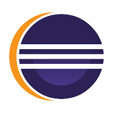

# Bonjour et bienvenue sur mon repository !

[VOIR LA PAGE INTERNET](https://damienrigaudeau.github.io/projet_portfolio/)

```html
<!DOCTYPE html>
<html lang="fr">
<head>
  <meta charset="UTF-8">
  <meta name="description" content="cours html et css...">
  <meta name="viewport" content="width=device-width, initial-scale=1.0">
  <title>Portfolio</title>
  <link rel="icon" type="image/png" href="asset/icone.png">
  <link rel="stylesheet" type="text/css" href="./css/style.css">
</head>
<body>
    <header>
        <h1> BTS SIO - SISR - Damien RIGAUDEAU</h1>
        <ol>
          <li><a href="#">Home</a></li>
          <li><a href="#exp">Experience</a></li>
          <li><a href="#etu">Etudes</a></li>
      </ol>
    </header>
 
        <main>
          
            <section>
              <h2>Compétences</h2>
              <p>

                Développeur technicien réseau, Monteur de pc fixe et pc portable (avec connaissances appronfondies des composants), très organisés, travailleur, manuel, vidéo montage, photographie...
              </p>
            </section>
            <section>
              
              <h2>Logiciels, IDE web ou expertise</h2>
              
              
              
              
            </section>
              
            <section id="exp">
              <h2>Expériences professionnelle ou stage</h2>
              <p>
                  CCD Technicien en support informatique en entreprise, CDD service technique de commune, CDD en archivage, travail dans le batiment (refonte de maison), garage (lavage de voiture)                
              </p>
              </section>
              
              <section id="etu">
              <h2>Etudes</h2>
              <ul>
                <li>En cours : BTS SIO : SISR</li>
                <li>Bac général spécialité ANGLAIS LLCE, NSI informatique</li>
                <li>Brevet des collèges</li>
              </ul>
              </section>

              <section>
              <h2>ACTIVITES EXTRA-PROFESSIONNELLES</h2>
              <p>
                Sports, travail, informatique, interet nouvelles technologies, sorties ...

              </p>
              </section>

        </main>

        <footer>
          <p>&copy; Made by damien rigaudeau</p>
        </footer>
    </body>
</html>
```
